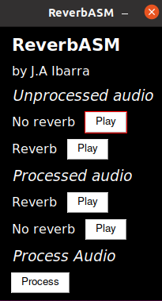

# ReverbASM

**ReverbASM** is a demonstration of adding reverb to an audio file, as well as removing it, using NASM x86 assembly language. The UI is quite simple and straightforward.

In short, a Python script converts a audio file in .wav format to a .txt with samples using 16 bit fixed point arithmetic. An assembly program then takes this data and outputs a new .txt file with the corresponding conversion applied. Finally, the Python script converts back to audio file and plays it.

* **Unprocessed audio:** Here, you can click on the "Play" buttons to hear two audio files, one with No Reverb and one with Reverb.
* **Process button:** This button on the lower left side of the screen compiles the assembly language file from source and calls it using the audio files provided as input.
* **Processed audio:** These two "Play" buttons allow you to listen to the newly generated audio files with Reverb and without it.

A couple of notes: the folder /asm-source includes the assembly source files. It's possible to modify the input file that each program will search for both for reverb.asm (adding reverb) and noreverb.asm (removing it).

The discrete equation for adding reverb is y(n)=(1-alpha) \* x(n) + alpha \* y(n-k), where y is the output, x is input, alpha is the attenuation factor and k the retardation. Because present outputs depend on previous outputs due to factor y(n-k), a circular buffer of size k is used.

Likewise, the equation for removing reverb is \[1/(1-alpha)\] \* \[x(n) - alpha \* x(n-k)\]. This also makes use of a circular buffer but for the input x.

The values of k and alpha can be changed at the beggining of main.py on lines 10 and 11. If k is changed here, the buffer size also needs to be changed in the source assembly files on line 40, except in this case the number k needs to be multiplied by the sample rate and truncated. 

For example, let's say you want to change k to 0.1. First change that in main.py line 11, then multiply by the audio sample rate (44100, for example) and enter that number on line 40 of one or both .asm files.

By default, the program will look for "audio.wav" and add reverb to create "audio-reverb-converted.wav" and for "audio-known-reverb.wav" and remove reverb to create "audio-noreverb-converted.wav". Default values for k and alpha are 0.05 and 0.6 respectively.

## Photos 📷

Main UI                       
:------------------------------:|
  | 


### Prerequisites 👓

Software you need to install to run this project:

```
Python 3.8 or higher (recommended)
Python libraries: simpleaudio, tkinter, pysimplegui, numpy, scipy, soundfile
Additional build libraries to compile to x86 NASM
```

### Installing 💻

On a Python default environment, execute main.py.

## Author 👨🏻‍💻

* **Alejandro Ibarra** - *Developer & Designer* - [AlejandroIbarraC](https://github.com/AlejandroIbarraC)

## License 📄

This project is licensed under the MIT License - see the [LICENSE.md](LICENSE.md) file for details

## Acknowledgments 📎

* Costa Rica Institute of Technology
* Kevin Cordero - [kevinscorzu](https://github.com/kevinscorzu)

<p align="center">This project was made with academical purposes. J.A Ibarra. 2021</p
```

